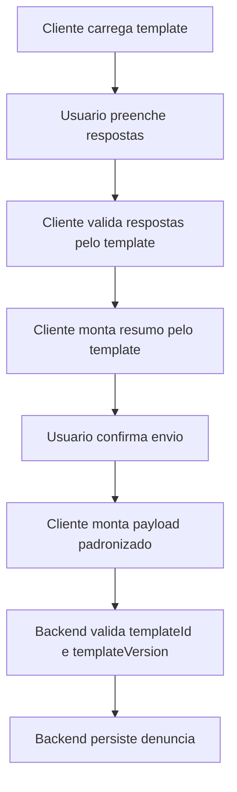

# Padronizacao Do Template De Envio Da Denuncia

Este documento descreve uma forma de padronizar o template de envio da denuncia para que web e app gerem o mesmo resumo, o mesmo payload e a mesma visualizacao antes do envio.

O objetivo nao e acoplar a regra a um projeto especifico. As referencias abaixo usam exemplos genericos de codigo para orientar a implementacao em qualquer frontend web, aplicativo mobile ou backend.

## Principio Central

A web e o app nao devem montar o template da denuncia separadamente. Ambos devem consumir um contrato unico de template, com:

- identificador e versao do template;
- secoes exibidas no resumo;
- campos, labels, obrigatoriedade e formatacao;
- regras de visibilidade;
- tokens visuais e regras de apresentacao;
- estrutura final do payload de envio.

Assim, qualquer alteracao no texto, na ordem dos campos ou nas regras do formulario acontece no contrato compartilhado, nao em duas telas diferentes.

Para que a experiencia tambem seja visualmente igual, o template deve separar:

- dados: campos, respostas, anexos e validacoes;
- conteudo: titulos, labels, textos de erro e textos de apoio;
- visual: cores, espacamentos, tipografia, estados e ordem dos elementos.

## Contrato Canonico Do Template

Exemplo de template retornado por uma API ou armazenado em um pacote compartilhado:

```json
{
  "templateId": "denuncia_padrao",
  "version": "1.0.0",
  "title": "Denuncia",
  "sections": [
    {
      "id": "victim_address",
      "title": "Endereco da vitima",
      "fields": [
        {
          "key": "victim.zipCode",
          "label": "CEP",
          "type": "text",
          "required": true,
          "format": "cep"
        },
        {
          "key": "victim.street",
          "label": "Logradouro",
          "type": "text",
          "required": true
        },
        {
          "key": "victim.neighborhood",
          "label": "Bairro",
          "type": "select",
          "required": true
        }
      ]
    },
    {
      "id": "occurrence",
      "title": "Dados da ocorrencia",
      "fields": [
        {
          "key": "occurrence.description",
          "label": "Descricao",
          "type": "textarea",
          "required": true,
          "minLength": 20
        },
        {
          "key": "occurrence.date",
          "label": "Data aproximada",
          "type": "date",
          "required": false
        }
      ]
    }
  ],
  "submitPayload": {
    "templateId": "{{templateId}}",
    "templateVersion": "{{version}}",
    "answers": "{{answers}}",
    "attachments": "{{attachments}}"
  }
}
```

## Modelo De Dados Compartilhado

Referencia em TypeScript:

```ts
type FieldType = 'text' | 'textarea' | 'number' | 'date' | 'select' | 'radio' | 'checkbox' | 'file';
type FieldFormat = 'cep' | 'cpf' | 'phone' | 'currency' | 'date';

type ComplaintTemplate = {
  templateId: string;
  version: string;
  title: string;
  sections: ComplaintSection[];
};

type ComplaintSection = {
  id: string;
  title: string;
  fields: ComplaintField[];
};

type ComplaintField = {
  key: string;
  label: string;
  type: FieldType;
  required?: boolean;
  format?: FieldFormat;
  minLength?: number;
  maxLength?: number;
  options?: Array<{
    value: string;
    label: string;
  }>;
  visibleWhen?: {
    fieldKey: string;
    operator: 'equals' | 'notEquals' | 'contains';
    value: string | boolean | number;
  };
};

type ComplaintAnswers = Record<string, unknown>;
```

Referencia equivalente em Dart:

```dart
class ComplaintTemplate {
  final String templateId;
  final String version;
  final String title;
  final List<ComplaintSection> sections;

  ComplaintTemplate({
    required this.templateId,
    required this.version,
    required this.title,
    required this.sections,
  });

  factory ComplaintTemplate.fromJson(Map<String, dynamic> json) {
    return ComplaintTemplate(
      templateId: json['templateId'] as String,
      version: json['version'] as String,
      title: json['title'] as String,
      sections: (json['sections'] as List<dynamic>)
          .map((item) => ComplaintSection.fromJson(item as Map<String, dynamic>))
          .toList(),
    );
  }
}

class ComplaintSection {
  final String id;
  final String title;
  final List<ComplaintField> fields;

  ComplaintSection({
    required this.id,
    required this.title,
    required this.fields,
  });

  factory ComplaintSection.fromJson(Map<String, dynamic> json) {
    return ComplaintSection(
      id: json['id'] as String,
      title: json['title'] as String,
      fields: (json['fields'] as List<dynamic>)
          .map((item) => ComplaintField.fromJson(item as Map<String, dynamic>))
          .toList(),
    );
  }
}

class ComplaintField {
  final String key;
  final String label;
  final String type;
  final bool required;
  final String? format;

  ComplaintField({
    required this.key,
    required this.label,
    required this.type,
    required this.required,
    this.format,
  });

  factory ComplaintField.fromJson(Map<String, dynamic> json) {
    return ComplaintField(
      key: json['key'] as String,
      label: json['label'] as String,
      type: json['type'] as String,
      required: json['required'] as bool? ?? false,
      format: json['format'] as String?,
    );
  }
}
```

## Especificacao Visual Compartilhada

A web e o app devem consumir os mesmos tokens visuais. A implementacao pode usar React, Flutter, SwiftUI ou outra tecnologia, mas os valores base precisam ser equivalentes.

Exemplo de tema visual versionado:

```json
{
  "themeId": "denuncia_visual_padrao",
  "version": "1.0.0",
  "colors": {
    "background": "#F7F8FA",
    "surface": "#FFFFFF",
    "textPrimary": "#1F2933",
    "textSecondary": "#52606D",
    "border": "#D9E2EC",
    "primary": "#24786B",
    "primaryPressed": "#206A5E",
    "danger": "#B42318",
    "success": "#1A7F37",
    "disabledBackground": "#E4E7EB",
    "disabledText": "#9AA5B1"
  },
  "typography": {
    "fontFamily": "Inter, system-ui, sans-serif",
    "screenTitle": {
      "fontSize": 22,
      "fontWeight": 700,
      "lineHeight": 28
    },
    "sectionTitle": {
      "fontSize": 18,
      "fontWeight": 700,
      "lineHeight": 24
    },
    "label": {
      "fontSize": 14,
      "fontWeight": 600,
      "lineHeight": 20
    },
    "body": {
      "fontSize": 16,
      "fontWeight": 400,
      "lineHeight": 24
    },
    "helper": {
      "fontSize": 13,
      "fontWeight": 400,
      "lineHeight": 18
    }
  },
  "spacing": {
    "screenPadding": 20,
    "sectionGap": 24,
    "fieldGap": 16,
    "labelGap": 6,
    "buttonGap": 12
  },
  "radius": {
    "input": 8,
    "button": 8,
    "card": 8,
    "modal": 12
  },
  "componentSize": {
    "inputHeight": 48,
    "buttonHeight": 48,
    "checkboxSize": 20,
    "radioSize": 20,
    "progressStepSize": 28
  }
}
```

## Layout Padrao Das Telas

Todas as plataformas devem seguir a mesma ordem visual:

1. Header com titulo da etapa.
2. Barra de progresso do formulario.
3. Conteudo da etapa atual.
4. Mensagens de erro abaixo do campo correspondente.
5. Acoes inferiores fixas ou posicionadas ao fim do conteudo, conforme o tamanho da tela.

Referencia declarativa:

```json
{
  "screenLayout": {
    "maxContentWidth": 720,
    "contentAlignment": "center",
    "header": {
      "height": 64,
      "showBackButton": true,
      "titleAlignment": "center"
    },
    "progress": {
      "position": "belowHeader",
      "showStepNumber": true,
      "showStepLabel": true
    },
    "footerActions": {
      "position": "bottom",
      "primaryButtonFullWidthOnMobile": true,
      "desktopAlignment": "space-between"
    }
  }
}
```

Referencia CSS para web:

```css
.complaint-screen {
  min-height: 100dvh;
  background: var(--color-background);
  color: var(--color-text-primary);
  font-family: var(--font-family);
}

.complaint-content {
  width: 100%;
  max-width: 720px;
  margin: 0 auto;
  padding: 20px;
}

.complaint-section {
  display: flex;
  flex-direction: column;
  gap: 16px;
  margin-top: 24px;
}

.complaint-actions {
  display: flex;
  gap: 12px;
  justify-content: space-between;
  margin-top: 24px;
}

@media (max-width: 600px) {
  .complaint-actions {
    flex-direction: column-reverse;
  }
}
```

Referencia em Flutter:

```dart
class ComplaintLayout extends StatelessWidget {
  final Widget progress;
  final Widget content;
  final Widget actions;

  const ComplaintLayout({
    super.key,
    required this.progress,
    required this.content,
    required this.actions,
  });

  @override
  Widget build(BuildContext context) {
    return Scaffold(
      backgroundColor: AppColors.background,
      appBar: AppBar(
        toolbarHeight: 64,
        centerTitle: true,
        title: const Text('Denuncia'),
      ),
      body: SafeArea(
        child: Center(
          child: ConstrainedBox(
            constraints: const BoxConstraints(maxWidth: 720),
            child: Padding(
              padding: const EdgeInsets.all(20),
              child: Column(
                children: [
                  progress,
                  const SizedBox(height: 24),
                  Expanded(child: content),
                  const SizedBox(height: 24),
                  actions,
                ],
              ),
            ),
          ),
        ),
      ),
    );
  }
}
```

## Padrao Visual Dos Campos

Todos os campos devem manter a mesma estrutura:

1. Label.
2. Indicador de obrigatoriedade, quando aplicavel.
3. Campo de entrada.
4. Texto de apoio, quando existir.
5. Mensagem de erro, quando existir.

Referencia declarativa:

```json
{
  "fieldPresentation": {
    "labelPosition": "top",
    "requiredIndicator": "*",
    "requiredIndicatorColor": "#B42318",
    "helperTextPosition": "belowInput",
    "errorTextPosition": "belowInput",
    "errorIcon": "alert-circle",
    "input": {
      "height": 48,
      "borderWidth": 1,
      "borderRadius": 8,
      "horizontalPadding": 12,
      "background": "#FFFFFF"
    }
  }
}
```

Referencia CSS para web:

```css
.field {
  display: flex;
  flex-direction: column;
  gap: 6px;
}

.field-label {
  color: var(--color-text-primary);
  font-size: 14px;
  font-weight: 600;
  line-height: 20px;
}

.field-required {
  color: var(--color-danger);
}

.field-input {
  min-height: 48px;
  border: 1px solid var(--color-border);
  border-radius: 8px;
  background: var(--color-surface);
  padding: 0 12px;
  color: var(--color-text-primary);
  font-size: 16px;
  line-height: 24px;
}

.field-input[data-invalid="true"] {
  border-color: var(--color-danger);
}

.field-error {
  color: var(--color-danger);
  font-size: 13px;
  line-height: 18px;
}
```

Referencia em Flutter:

```dart
InputDecoration complaintInputDecoration({
  required String label,
  String? helperText,
  String? errorText,
}) {
  return InputDecoration(
    labelText: label,
    helperText: helperText,
    errorText: errorText,
    filled: true,
    fillColor: AppColors.surface,
    contentPadding: const EdgeInsets.symmetric(horizontal: 12, vertical: 12),
    border: OutlineInputBorder(
      borderRadius: BorderRadius.circular(8),
      borderSide: const BorderSide(color: AppColors.border),
    ),
    enabledBorder: OutlineInputBorder(
      borderRadius: BorderRadius.circular(8),
      borderSide: const BorderSide(color: AppColors.border),
    ),
    errorBorder: OutlineInputBorder(
      borderRadius: BorderRadius.circular(8),
      borderSide: const BorderSide(color: AppColors.danger),
    ),
  );
}
```

## Padrao Visual Dos Botoes

Os botoes devem ter a mesma hierarquia:

- primario: avanca, confirma ou envia;
- secundario: volta ou cancela;
- destrutivo: remove foto ou descarta rascunho.

```json
{
  "buttonPresentation": {
    "height": 48,
    "borderRadius": 8,
    "horizontalPadding": 16,
    "fontSize": 16,
    "fontWeight": 700,
    "states": {
      "default": {
        "opacity": 1
      },
      "pressed": {
        "opacity": 0.92
      },
      "disabled": {
        "opacity": 1,
        "background": "#E4E7EB",
        "text": "#9AA5B1"
      },
      "loading": {
        "showSpinner": true,
        "hideIcon": true
      }
    }
  }
}
```

## Resumo Visual Da Denuncia

O resumo final precisa manter a mesma agrupacao visual e a mesma ordem dos itens. A tela nao deve reconstruir secoes manualmente.

```json
{
  "summaryPresentation": {
    "sectionTitleStyle": "sectionTitle",
    "itemLayout": "labelAboveValue",
    "sectionDivider": true,
    "emptyValueText": "Nao informado",
    "photoPreview": {
      "thumbnailSize": 96,
      "borderRadius": 8,
      "columnsMobile": 3,
      "columnsDesktop": 5
    }
  }
}
```

Referencia de renderer neutro:

```ts
function renderSummaryView(items: SummaryItem[]) {
  const grouped = items.reduce<Record<string, SummaryItem[]>>((accumulator, item) => {
    accumulator[item.sectionId] = accumulator[item.sectionId] ?? [];
    accumulator[item.sectionId].push(item);
    return accumulator;
  }, {});

  return Object.entries(grouped).map(([sectionId, sectionItems]) => ({
    sectionId,
    title: sectionItems[0]?.sectionTitle ?? '',
    items: sectionItems.map((item) => ({
      label: item.label,
      value: item.value || 'Nao informado',
    })),
  }));
}
```

## Estados Visuais Obrigatorios

Cada componente deve ter comportamento visual padronizado nos seguintes estados:

| Componente | Estados obrigatorios |
| --- | --- |
| Campo de texto | default, foco, preenchido, erro, desabilitado |
| Select | fechado, aberto, selecionado, sem opcoes, erro |
| Checkbox | marcado, desmarcado, foco, erro, desabilitado |
| Radio | selecionado, nao selecionado, foco, erro, desabilitado |
| Upload | vazio, carregando, anexado, erro, removendo |
| Botao | default, pressionado, carregando, desabilitado |
| Barra de progresso | pendente, atual, concluido, bloqueado |
| Modal | informativo, confirmacao, sucesso, erro |

## Testes Visuais De Paridade

A igualdade visual deve ser validada com capturas em cenarios fixos. O mesmo template e as mesmas respostas devem gerar telas equivalentes na web e no app.

Fixtures recomendadas:

- formulario vazio;
- formulario com erros obrigatorios;
- formulario parcialmente preenchido;
- formulario completo;
- resumo com fotos;
- resumo sem campos opcionais;
- envio em carregamento;
- modal de sucesso;
- modal de erro.

Referencia de comparacao:

```ts
type VisualFixture = {
  name: string;
  viewport: {
    width: number;
    height: number;
  };
  template: ComplaintTemplate;
  answers: ComplaintAnswers;
  expectedScreen: 'form' | 'summary' | 'success' | 'error';
};
```

Regras minimas:

1. Usar os mesmos dados de entrada na web e no app.
2. Capturar telas nos tamanhos `360x800`, `390x844`, `768x1024` e `1440x900`.
3. Validar ordem dos elementos, labels, estados de erro, botoes e resumo.
4. Comparar screenshots com tolerancia baixa para diferencas de renderizacao de fonte.
5. Bloquear release quando uma alteracao visual ocorrer em apenas uma plataforma.

## Renderizacao Unica Do Resumo

O resumo exibido antes do envio deve ser gerado a partir do mesmo template e das mesmas respostas em todos os clientes.

Referencia em TypeScript:

```ts
type SummaryItem = {
  sectionId: string;
  sectionTitle: string;
  fieldKey: string;
  label: string;
  value: string;
};

function buildComplaintSummary(
  template: ComplaintTemplate,
  answers: ComplaintAnswers
): SummaryItem[] {
  return template.sections.flatMap((section) =>
    section.fields
      .filter((field) => isVisible(field, answers))
      .map((field) => ({
        sectionId: section.id,
        sectionTitle: section.title,
        fieldKey: field.key,
        label: field.label,
        value: formatAnswer(answers[field.key], field),
      }))
  );
}

function isVisible(field: ComplaintField, answers: ComplaintAnswers): boolean {
  if (!field.visibleWhen) return true;

  const currentValue = answers[field.visibleWhen.fieldKey];

  if (field.visibleWhen.operator === 'equals') {
    return currentValue === field.visibleWhen.value;
  }

  if (field.visibleWhen.operator === 'notEquals') {
    return currentValue !== field.visibleWhen.value;
  }

  if (field.visibleWhen.operator === 'contains') {
    return Array.isArray(currentValue) && currentValue.includes(field.visibleWhen.value);
  }

  return true;
}

function formatAnswer(value: unknown, field: ComplaintField): string {
  if (value === null || value === undefined || value === '') {
    return 'Nao informado';
  }

  if (field.format === 'cep') {
    return String(value).replace(/^(\d{5})(\d{3})$/, '$1-$2');
  }

  if (field.type === 'checkbox' && Array.isArray(value)) {
    return value.join(', ');
  }

  return String(value);
}
```

Referencia em Dart:

```dart
class SummaryItem {
  final String sectionId;
  final String sectionTitle;
  final String fieldKey;
  final String label;
  final String value;

  SummaryItem({
    required this.sectionId,
    required this.sectionTitle,
    required this.fieldKey,
    required this.label,
    required this.value,
  });
}

List<SummaryItem> buildComplaintSummary(
  ComplaintTemplate template,
  Map<String, dynamic> answers,
) {
  final items = <SummaryItem>[];

  for (final section in template.sections) {
    for (final field in section.fields) {
      items.add(
        SummaryItem(
          sectionId: section.id,
          sectionTitle: section.title,
          fieldKey: field.key,
          label: field.label,
          value: formatAnswer(answers[field.key], field),
        ),
      );
    }
  }

  return items;
}

String formatAnswer(dynamic value, ComplaintField field) {
  if (value == null || value == '') {
    return 'Nao informado';
  }

  if (field.format == 'cep') {
    final digits = value.toString().replaceAll(RegExp(r'\D'), '');
    if (digits.length == 8) {
      return '${digits.substring(0, 5)}-${digits.substring(5)}';
    }
  }

  if (value is List) {
    return value.join(', ');
  }

  return value.toString();
}
```

## Payload De Envio Padronizado

O envio deve ser independente da plataforma. Web e app devem produzir a mesma estrutura:

```json
{
  "templateId": "denuncia_padrao",
  "templateVersion": "1.0.0",
  "source": "web",
  "answers": {
    "victim.zipCode": "60000000",
    "victim.street": "Rua Exemplo",
    "victim.neighborhood": "Centro",
    "occurrence.description": "Texto informado pela pessoa denunciante."
  },
  "attachments": [
    {
      "fieldKey": "occurrence.photos",
      "fileName": "foto-1.jpg",
      "contentType": "image/jpeg",
      "storageKey": "uploads/denuncias/abc/foto-1.jpg"
    }
  ]
}
```

Referencia de montagem:

```ts
type SubmitComplaintPayload = {
  templateId: string;
  templateVersion: string;
  source: 'web' | 'app';
  answers: ComplaintAnswers;
  attachments: Array<{
    fieldKey: string;
    fileName: string;
    contentType: string;
    storageKey: string;
  }>;
};

function buildSubmitPayload(params: {
  template: ComplaintTemplate;
  source: 'web' | 'app';
  answers: ComplaintAnswers;
  attachments: SubmitComplaintPayload['attachments'];
}): SubmitComplaintPayload {
  return {
    templateId: params.template.templateId,
    templateVersion: params.template.version,
    source: params.source,
    answers: normalizeAnswers(params.answers),
    attachments: params.attachments,
  };
}

function normalizeAnswers(answers: ComplaintAnswers): ComplaintAnswers {
  return Object.fromEntries(
    Object.entries(answers).map(([key, value]) => {
      if (typeof value === 'string') {
        return [key, value.trim()];
      }

      return [key, value];
    })
  );
}
```

## Validacao Compartilhada

A validacao tambem deve seguir o template. Isso evita casos em que um campo seja obrigatorio na web e opcional no app.

```ts
type ValidationError = {
  fieldKey: string;
  message: string;
};

function validateComplaintAnswers(
  template: ComplaintTemplate,
  answers: ComplaintAnswers
): ValidationError[] {
  const errors: ValidationError[] = [];

  for (const section of template.sections) {
    for (const field of section.fields) {
      if (!isVisible(field, answers)) continue;

      const value = answers[field.key];
      const isEmpty = value === null || value === undefined || value === '';

      if (field.required && isEmpty) {
        errors.push({
          fieldKey: field.key,
          message: `${field.label} e obrigatorio.`,
        });
      }

      if (field.minLength && typeof value === 'string' && value.length < field.minLength) {
        errors.push({
          fieldKey: field.key,
          message: `${field.label} deve ter pelo menos ${field.minLength} caracteres.`,
        });
      }
    }
  }

  return errors;
}
```

## Testes De Paridade Entre Web E App

Para garantir que as duas plataformas continuem iguais, manter fixtures compartilhadas:

```json
{
  "caseName": "denuncia_minima_valida",
  "template": {
    "templateId": "denuncia_padrao",
    "version": "1.0.0",
    "title": "Denuncia",
    "sections": []
  },
  "answers": {
    "victim.zipCode": "60000000",
    "occurrence.description": "Descricao minima valida para o envio."
  },
  "expectedPayload": {
    "templateId": "denuncia_padrao",
    "templateVersion": "1.0.0"
  }
}
```

Referencia de teste na web:

```ts
import fixture from './fixtures/denuncia-minima-valida.json';

it('gera o payload padronizado da denuncia', () => {
  const payload = buildSubmitPayload({
    template: fixture.template,
    source: 'web',
    answers: fixture.answers,
    attachments: [],
  });

  expect(payload.templateId).toBe(fixture.expectedPayload.templateId);
  expect(payload.templateVersion).toBe(fixture.expectedPayload.templateVersion);
});
```

Referencia de teste no app:

```dart
test('gera o payload padronizado da denuncia', () {
  final fixture = loadJsonFixture('denuncia-minima-valida.json');
  final template = ComplaintTemplate.fromJson(fixture['template']);

  final payload = buildSubmitPayload(
    template: template,
    source: 'app',
    answers: Map<String, dynamic>.from(fixture['answers']),
    attachments: [],
  );

  expect(payload.templateId, fixture['expectedPayload']['templateId']);
  expect(payload.templateVersion, fixture['expectedPayload']['templateVersion']);
});
```

## Regras De Implementacao

1. O backend ou um pacote compartilhado deve ser a fonte da verdade do template.
2. O template deve possuir `templateId` e `version` obrigatorios.
3. Web e app devem usar as mesmas chaves de resposta, por exemplo `victim.zipCode` e `occurrence.description`.
4. O resumo final deve ser montado pelo template, nao por textos fixos dentro da tela.
5. O payload enviado deve conter `templateId`, `templateVersion`, `answers` e `attachments`.
6. Campos condicionais devem usar uma regra declarativa como `visibleWhen`.
7. Formatadores como CEP, CPF, telefone e data devem ter comportamento equivalente nas duas plataformas.
8. Toda mudanca de template deve gerar uma nova versao.
9. Fixtures de paridade devem ser usadas para validar web e app com os mesmos dados de entrada.
10. O backend deve validar novamente o payload usando a mesma versao do template informada no envio.

## Fluxo Recomendado



## Resultado Esperado

Com essa abordagem, web e app podem ter componentes visuais diferentes, mas continuam iguais no que importa:

- mesmas perguntas;
- mesmos labels;
- mesma ordem de exibicao;
- mesmas regras de obrigatoriedade;
- mesmo resumo final;
- mesmo payload enviado para a API;
- mesma versao rastreavel do template usado na denuncia.
